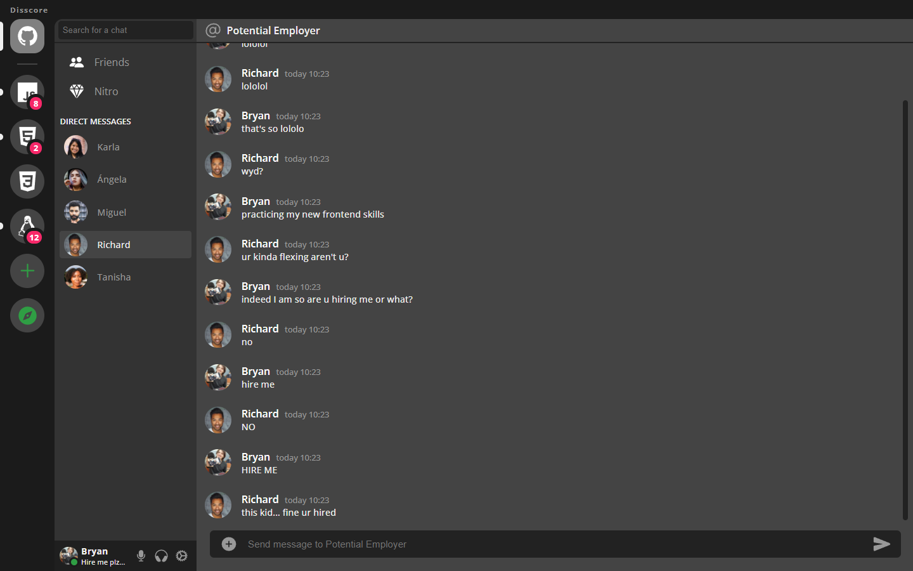

# DiscordDesktopLayout
This is a CSS layouts practice (and actually I ended up including some JavaScript) meant to be a sort of reinforcement of some of the things I've been learning lately😀

Vanilla code only

